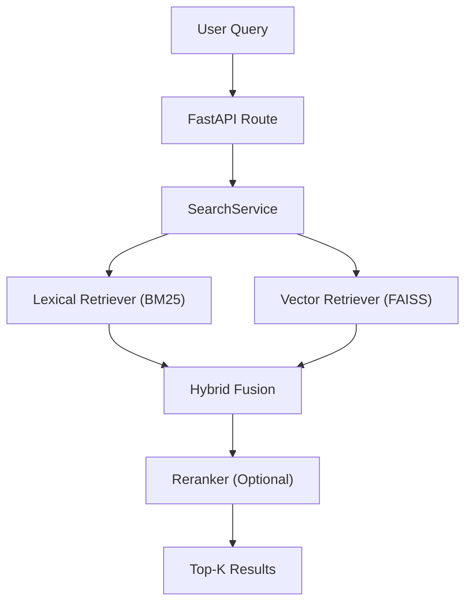

# Production-Grade Retrieval Platform

A production-grade retrieval system designed with modular architecture,
hybrid search, and measurable evaluation.

This system prioritises:
- Measurable retrieval quality (evaluation framework)
- Modular architecture (independent components)
- Low-latency local deployment
- Extensibility toward production systems


## Features

-   Hybrid retrieval (BM25 + vector search)
-   Optional reranking layer
-   Multi-format ingestion (PDF, CSV, TXT, Markdown)
-   Modular pipeline (ingestion → processing → indexing → retrieval)
-   FastAPI-based search API
-   CLI interface for quick testing
-   Evaluation framework:
    -   Precision@5
    -   Recall@5
    -   NDCG@5
-   Docker support
-   Full unit + integration tests


## Architecture Overview

Pipeline:

1.  **Discovery** → finds raw documents\
2.  **Extraction** → parses documents into text\
3.  **Normalisation** → cleans text\
4.  **Chunking** → splits into retrieval units\
5.  **Indexing**:
    -   FAISS (vector)\
    -   SQLite / BM25 (lexical)\
6.  **Retrieval**:
    -   lexical\
    -   semantic\
    -   hybrid\
    -   hybrid + rerank\
7.  **Serving** → FastAPI + CLI

## System Design




## Project Structure

    app/
      api/            # API routes
      core/           # search service
      ingestion/      # ingestion pipeline
      processing/     # chunking + normalisation
      indexing/       # FAISS + SQLite
      retrieval/      # retrievers + reranker
      evaluation/     # metrics + runner
      scripts/        # CLI tools

    data/
      raw/            # input documents
      processed/      # generated indexes
      evaluation/     # queries + qrels + runs

    tests/
      unit/
      integration/


## Setup

``` bash
git clone https://github.com/aditya-kamatt/production-grade-retrieval-platform.git

cd production-grade-retrieval-platform

python -m venv .venv
source .venv/bin/activate

pip install -r requirements.txt
```


## Run Ingestion

``` bash
python app/scripts/run_ingestion.py
```

This: 
- extracts documents 
- chunks text 
- builds embeddings 
- writes indexes


## Run API

``` bash
uvicorn app.main:app --reload
```

Open: http://127.0.0.1:8000/docs


## Example Request

    POST /search

``` json
{
  "query": "BERT pretraining method",
  "top_k": 5
}
```
### Example Output
```json
{
  "query": "BERT pretraining method",
  "results": [
    {
      "chunk_id": "76a3872d244793563a5b000b818cbaf0ca8972ab1145d32be474c05b2a8f3070_2_7d62844e4166a1ab",
      "document_id": "76a3872d244793563a5b000b818cbaf0ca8972ab1145d32be474c05b2a8f3070",
      "text": "We present a replication study of BERT pre-training ... and propose an improved recipe for training BERT models, which we call RoBERTa.",
      "metadata": {
        "source_path": "data/raw/pdf/pdf_roberta_05.pdf",
        "file_type": "pdf",
        "chunk_index": 2
      },
      "fused_score": 0.0161,
      "rerank_score": 6.10,
      "component_scores": {
        "bm25": 0.0,
        "vector": 0.6684,
        "hybrid": 0.0161,
        "reranker": 6.10
      },
      "rank": 1,
      "latency_ms": 122.36
    }
  ]
}
```


## CLI Search

``` bash
python app/scripts/search_cli.py
```


## Run Tests

``` bash
pytest
```

## Evaluation

Located in:

    app/evaluation/
    data/evaluation/

Run:

``` bash
python app/evaluation/runner.py
```

**Metrics**:
 - Precision@5 
 - Recall@5 
 - NDCG@5


**Compare**: 
- Semantic-only 
- Hybrid 
- Hybrid + rerank

## Evaluation Results

| Config              | Precision@5 | Recall@5 | nDCG@5 | Latency (ms) |
|---------------------|------------|----------|--------|--------------|
| Semantic            | 0.327      | 0.886    | 0.882  | 9.4          |
| Hybrid              | 0.309      | 0.856    | 0.838  | 11.8         |
| Hybrid + Reranker   | 0.364      | 0.932    | 0.903  | 42.3         |

**Key Observations**

- Hybrid retrieval alone slightly underperforms semantic search due to score fusion noise.
- Adding a reranker significantly improves ranking quality:
  - Precision@5: 0.309 → 0.364
  - nDCG@5: 0.838 → 0.903
  - Recall@5: 0.856 → 0.932
- This comes at a latency cost (~4x), highlighting the trade-off between accuracy and performance.

## Docker

``` bash
docker build -t retrieval-platform .
docker run -p 8000:8000 retrieval-platform
```


## Design Decisions

-   Hybrid search improves robustness over pure lexical/semantic
-   Modular design allows independent testing and tuning
-   Evaluation-first mindset ensures measurable correctness

## Production Considerations

- Latency: ~9–12ms per query depending on configuration
- Scalability: Single-node (SQLite + FAISS), not horizontally scalable
- Model cost: Lazy loading reduces startup overhead
- Trade-off: Hybrid improves robustness but increases latency


## Known Limitations

-   Ingestion required before search
-   Retrieval quality depends on chunking + qrels
-   Reranking increases latency

## Future Improvements

-   Chunk-size experimentation
-   Caching embeddings
-   Latency monitoring
-   Better evaluation reporting
-   Production observability


